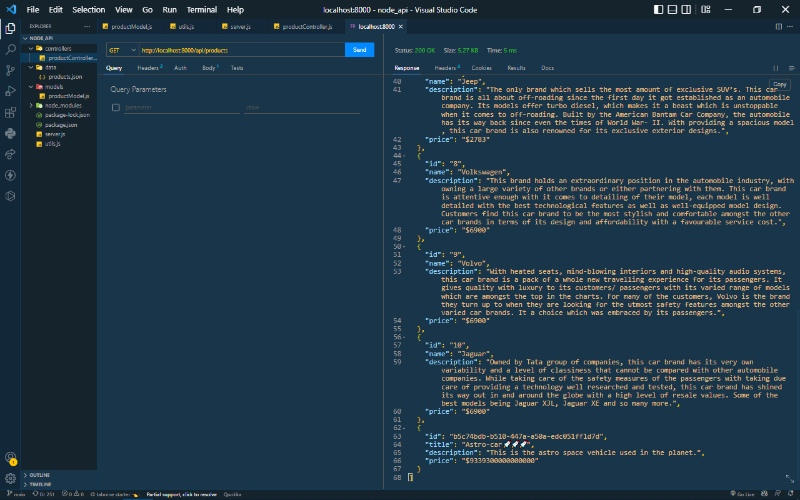
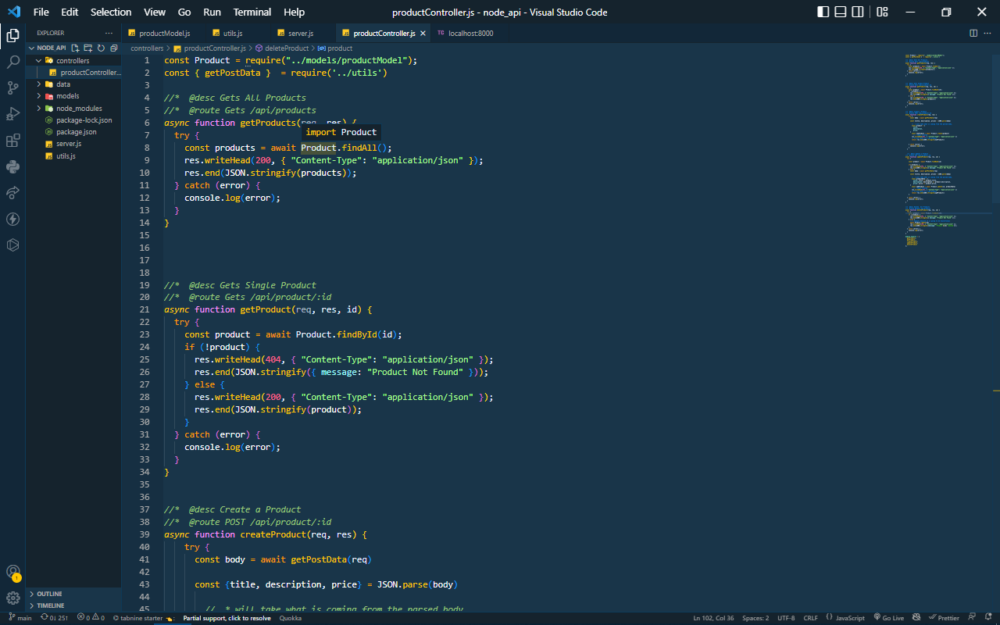
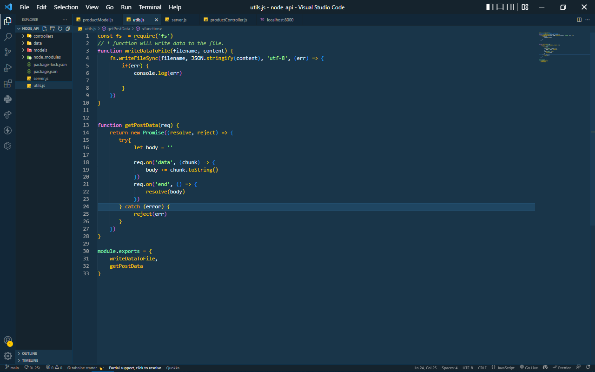
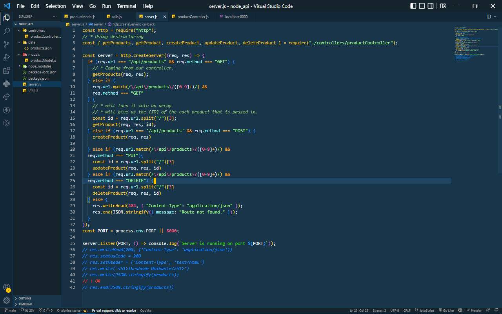

# Vanila Node (js) api

## By *Omikunle Ibraheem*

---
___

###  Requirements 
* nodemon
* uuid

```node
npm i nodemon -D
npm i uuid
```
---


# Display or Getting all products



# Configured controllers



# Utils file for more functionality



# # this is how our server was managed 
`[CREATE, DELETE, PUT and POST]`



